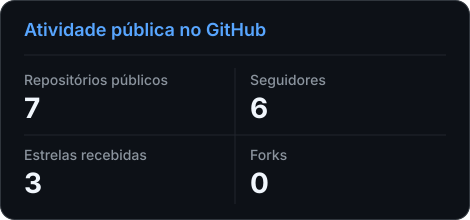
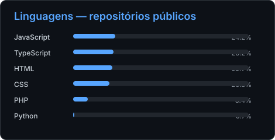

<h1>Roberto Átila</h1>

<strong>Desenvolvedor full-stack com foco em backend, cloud e segurança</strong>

Construo aplicações completas com Java, Spring Boot, Next.js e TypeScript, do banco de dados ao deploy.

## Sobre mim

Sou estudante da **ETEC Jacinto Ferreira de Sá**, em Ourinhos-SP, cursando **Técnico em Informática para Internet** e **Técnico em Desenvolvimento de Sistemas**.

Gosto de entender o sistema inteiro: interface, regras de negócio, APIs, banco de dados, autenticação, infraestrutura e deploy. Meu foco está na interseção entre **backend, arquitetura de software, cloud e segurança de aplicações**.

Atualmente concentro meu desenvolvimento no **MarkitosSystem** e planejo aprofundar academicamente **Segurança da Informação** na Fatec.

## Projeto em destaque

### MarkitosSystem

> Sistema full-stack de faturamento e estoque com frontend em Next.js, backend em Spring Boot e dados isolados por empresa.

#### Arquitetura atual

<code>Next.js 15.5.21</code> <code>React 19.1.0</code> <code>TypeScript 5</code> <code>Java 17</code> <code>Spring Boot 3.5.16</code> <code>MySQL 8</code>

#### O que o projeto demonstra

- **Segurança e acesso:** autenticação JWT com cookie HttpOnly, senhas com BCrypt, autorização baseada em papéis e isolamento por empresa.
- **Faturamento:** faturas de venda e compra integradas às movimentações de estoque.
- **Estoque:** reserva, baixa, estorno, depósitos, lotes, Kardex e inventário.
- **Qualidade e operação:** Flyway, testes de backend e frontend, E2E com Playwright, acessibilidade com Axe e ambiente Docker.

> O repositório principal permanece privado durante o desenvolvimento.

## Projetos públicos

### Aplicações

- **[EduGestor v3](https://github.com/robertoatila/EduGestor-v3)** 
  Gestão escolar com alunos, notas, frequência, relatórios, autenticação e integrações externas. 
  <strong>Stack:</strong> <code>PHP</code> <code>React</code> <code>TypeScript</code> <code>SQLite</code> <code>Supabase</code>

- **[Sushi & Sashimi Bar](https://github.com/robertoatila/Atividade-ProjetoFinal-ExpoGo)** 
  Aplicativo acadêmico de restaurante com cardápio, navegação, perfil e status de funcionamento. 
  <strong>Stack:</strong> <code>React Native</code> <code>Expo</code> <code>JavaScript</code>

- **[Portfólio Arduino](https://github.com/robertoatila/Portf-lios-de-Projetos-Arduino)** 
  Portfólio web sem frameworks, com PWA, animações e recursos interativos para projetos Arduino. 
  <strong>Stack:</strong> <code>HTML</code> <code>CSS</code> <code>JavaScript</code> <code>PWA</code>

- **[Cartão de Visitas Digital](https://github.com/robertoatila/Cartao-de-visitas)** 
  Aplicativo mobile de apresentação profissional com três áreas e navegação baseada em estado. 
  <strong>Stack:</strong> <code>React Native</code> <code>JavaScript</code>

### Jogos

- **[Sonic e as Escadas 2.0](https://github.com/robertoatila/Sonic-Game)** 
  Jogo didático de plataformas com física de salto, colisões e inimigos, desenvolvido em coautoria com Pietro Ferreira. 
  <strong>Stack:</strong> <code>HTML</code> <code>CSS</code> <code>JavaScript</code>

- **[Invincible: Invasão de Marte](https://github.com/robertoatila/invincible-game)** 
  Jogo side-scrolling com progressão de dificuldade e boss final. 
  <strong>Stack:</strong> <code>Canvas</code> <code>JavaScript</code>

## Tecnologias

### Backend e APIs

   

### Frontend e mobile

      

### Cloud, infraestrutura e DevOps

   

### Dados

  

### Engenharia na prática

<code>APIs REST</code> <code>JWT</code> <code>RBAC</code> <code>Cookies HttpOnly</code> <code>BCrypt</code> <code>Flyway</code> <code>Testes E2E</code> <code>Acessibilidade</code> <code>Docker</code>

## Atividade no GitHub

Cards gerados neste repositório com GitHub Actions e a API oficial do GitHub. Os dados representam apenas a atividade pública.

## Contato

Para conversar sobre desenvolvimento full-stack, backend, cloud ou segurança de aplicações, entre em contato.

  

